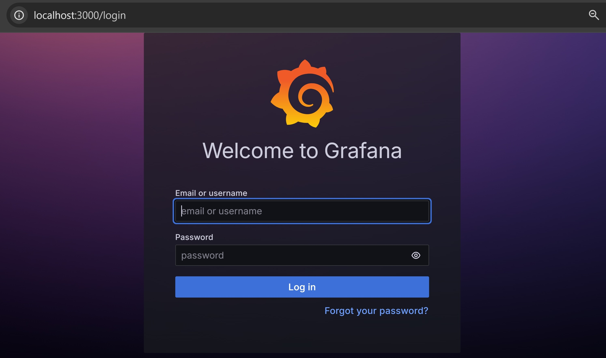

# Kubernetes HomeLab

**Setting:** 3 VMs (a cluster with 1 master node + 2 worker node)   
**OS:** Ubuntu server LTS 24.04.3  
**Hypervisor:** VMware workstation

## Table of Contents

[1. Download necessary tools and setup](#1-download-necessary-tools-and-setup)
- [1.1. Update package manager and HTTPS set up](#11-update-package-manager-and-https-set-up)
- [1.2 Disable swap](#12-disable-swap)
- [1.3. Networking Configuration](#13-networking-configuration)
- [1.4. Install & configure containerd](#14-install--configure-containerd)
- [1.5. Install kubeadm, kubelet, kubectl](#15-install-kubeadm-kubelet-kubectl)
- [1.6. zzz](#16--on-master-node)
- [1.7. (optional) Download Git](#17-optional-download-git)

[2. Labs](#2-labs)

[3. Error Documentation](#3-error-documentation)

[4. Useful Information](#4-useful-information)

---

# 📘 1. Download necessary tools and setup

## 📘 1.1. Update package manager and HTTPS set up

<pre>
sudo apt update
sudo apt install -y apt-transport-https ca-certificates curl
</pre>

- `-y` = yes to all prompt
- `apt-transport-https` allows APT to download packages over HTTPS.
- `ca-certificates` verify TLS of the other ends.
- `curl` fetch/send data over the internet.

## 📘 1.2. Disable swap

  swap = disk space used as extra RAM when real RAM is full.

  Kubernetes wants real, predictable RAM, not disk-based memory.

  <pre>
  sudo swapoff -a
  sudo sed -i '/swap/ s/^/#/' /etc/fstab</pre>

  - `sed` = Stream EDitor.
    It’s a command-line tool for finding/replacing text in files.

    In our case, we used sed to add a # at the beginning of lines in /etc/fstab that configure swap.

  - `/etc/fstab` lists filesystems that should be mounted automatically at boot.
    That includes disks, partitions, and also swap files/partitions. At boot, systemd reads /etc/fstab and mounts (activates) everything in it.
    So if a swap entry is in /etc/fstab and not commented out, swap will be turned on every reboot.

  See: 
  - [Swap Off - why is it necessary?](https://discuss.kubernetes.io/t/swap-off-why-is-it-necessary/6879)
  - [Kubelet/Kubernetes should work with Swap Enabled](https://github.com/kubernetes/kubernetes/issues/53533)

## 📘 1.3. Networking Configuration

  *To be honest, this part I still didn't get that 100%.
  But we have to run below snippet.

  <pre>
  cat &lt;&lt;EOF | sudo tee /etc/modules-load.d/k8s.conf
  overlay
  br_netfilter
  EOF

  sudo modprobe overlay
  sudo modprobe br_netfilter

  cat &lt;&lt;EOF | sudo tee /etc/sysctl.d/99-kubernetes-cri.conf
  net.bridge.bridge-nf-call-iptables  = 1
  net.bridge.bridge-nf-call-ip6tables = 1
  net.ipv4.ip_forward                 = 1
  EOF

  sudo sysctl --system
  </pre>

  - `/etc/modules-load.d/k8s.conf` This file tells Linux which kernel modules to load automatically at boot.

  - `overlay` Enables the overlay filesystem, which is essential for container runtimes (like containerd or Docker). Containers often use overlayfs to stack layers of images efficiently.

  - `br_netfilter` Allows Linux bridges (used in Kubernetes networking) to pass traffic through iptables for filtering and NAT. Without this, Kubernetes services and pods may not be able to communicate properly across nodes.

  - `modprobe` Loads a kernel module right now without rebooting.

  This creates a file in /etc/sysctl.d/ which sets persistent kernel parameters (applied at boot).

net.bridge.bridge-nf-call-iptables = 1
Makes sure that traffic across Linux bridges (used by CNI plugins like Flannel, Calico, etc.) is visible to iptables. This lets Kubernetes enforce network policies and NAT.

net.bridge.bridge-nf-call-ip6tables = 1
Same as above but for IPv6 traffic.

net.ipv4.ip_forward = 1
Enables packet forwarding between network interfaces. Without this, your node would not route packets from pods to other pods/services or to the outside world.

  - `sysctl` applies changes to the kernel parameters immediately.

  - `--system` = reload all config files.

## 📘 1.4. Install & configure containerd

## 📘 1.5. Install kubeadm, kubelet, kubectl

<pre>
sudo mkdir -p /etc/apt/keyrings
curl -fsSL https://pkgs.k8s.io/core:/stable:/v1.34/deb/Release.key | sudo gpg --dearmor -o /etc/apt/keyrings/kubernetes-apt-keyring.gpg

echo 'deb [signed-by=/etc/apt/keyrings/kubernetes-apt-keyring.gpg] https://pkgs.k8s.io/core:/stable:/v1.34/deb/ /' \
  | sudo tee /etc/apt/sources.list.d/kubernetes.list

sudo apt-get update
sudo apt-get install -y kubelet kubeadm kubectl
sudo apt-mark hold kubelet kubeadm kubectl
</pre>

optionally enable kubelet (it will sit waiting until kubeadm configures it)

<pre>sudo systemctl enable --now kubelet</pre>

## 📘 1.6.  (on master node)

<pre>
sudo kubeadm init --pod-network-cidr=192.168.0.0/16 --upload-certs

mkdir -p $HOME/.kube
sudo cp -i /etc/kubernetes/admin.conf $HOME/.kube/config
sudo chown $(id -u):$(id -g) $HOME/.kube/config
</pre>

then check if node ready

<pre>kubectl get nodes</pre>

After that download CNI plugins

kubectl apply -f https://docs.projectcalico.org/manifests/calico.yaml

or 

kubectl apply -f https://raw.githubusercontent.com/flannel-io/flannel/master/Documentation/kube-flannel.yml

then if status = Ready paste the  
kubeadm join <master-ip>:6443 --token <token> --discovery-token-ca-cert-hash sha256:<hash>
that get from output of kubeadm init on workernode to join.

then check 

kubectl get nodes

Done! Now my cluster is ready.

## 📘 1.7. (optional) Download Git

<pre>sudo apt install git -y</pre>

I use git to download manifest files (by cloning this repo) to do lab. 

*Sometimes DHCP might not propagate DNS properly, we can done by add DNS to the interface. 

<pre>sudo resolvectl dns &lt;interface name e.g. ens33&gt; 8.8.8.8 8.8.4.4</pre>

## 📘 1.8. (optional) Download Helm

<pre>curl https://raw.githubusercontent.com/helm/helm/main/scripts/get-helm-3 | bash</pre>

---

# 🧪 2. Labs

## 🧪 Lab 2.1. Basic `kubectl` commands

- `kubectl get <resource type>` 
  
  below is the output from `kubectl get nodes`.

  <pre>NAME          STATUS   ROLES           AGE    VERSION
  masternode    Ready    control-plane   3d7h   v1.34.1
  workernode1   Ready    &lt;none&gt;          3d7h   v1.34.1
  workernode2   Ready    &lt;none&gt;          3d7h   v1.34.1</pre>

  Normally worker nodes will have ROLES = none which is normal.

  **o = output**  
  Use flags like `-o json` or `-o yaml` for more longer info/formats.

- `kubectl describe <resource type>`

- `kubectl api-resources`  
  shows all resources we can work with *based on plug-ins* we have in the cluster.

- `kubectl explain <resource type>`

  `kubectl explain <resource type> --recursive`

  `kubectl explain <resource type>.<resource field>`

- `kubectl get <resource type>` 

- `-n <namespace name>` = `--namespace=<namespace name>`   
  `-A` = `--all-namespaces`  
  These are flags that can scope the result of certain command.

  I will

## 🧪 Lab 2.2. Observability stack

<pre> kubectl create namespace monitoring
helm repo add prometheus-community https://prometheus-community.github.io/helm-charts
helm repo update
helm install prometheus prometheus-community/kube-prometheus-stack -n monitorin
</pre>

forwarding grafana to localhost 3000

<pre>kubectl port-forward svc/prometheus-grafana -n monitoring 3000:80</pre>

get username password

<pre>
kubectl get secret prometheus-grafana -n monitoring -o jsonpath="{.data.admin-password}" | base64 --decode ; echo
</pre>

Now we want to use another shell to forward vm port to main machine port

<pre>ssh -L 3000:localhost:3000 vm0 </pre>

When open browser with localhost:3000 it shows like this

Then click 'Expore' on left tab

---

# ⚠️ 3. Error Documentation

## ⚠️ 3.1. Why we can't edit `/etc/fstab` with `nano` but can with `sed`.
Even with sudo, you can’t always edit a file because of how the editor interacts with the filesystem:

Some editors, including nano, try to create a temporary swap/backup file in the same directory (/etc/) before saving.

If the filesystem is read-only (common for root partitions in some recovery or minimal setups) or if permissions are restricted for creating new files, nano cannot write its temp file → editing fails.

Even if the original file is owned by root, writing via an editor may require extra permissions for temp files.

Why sed works

sed -i (in-place edit) directly writes to the file at the system call level.

It doesn’t create a temporary swap file in the directory (or if it does, it uses a safe atomic rename inside a writable tmp location).

So as long as you run sed with sudo, it has permission to modify the file itself, even if editors fail.

## ⚠️ 3.2. pod is not ready, stuck at `ImagePullBackOff`

<pre>
masternode@masternode:~$ kubectl run pingpong --image alpine ping 1.1.1.1
pod/pingpong created
masternode@masternode:~$ kubectl get all
NAME           READY   STATUS             RESTARTS   AGE
pod/pingpong   0/1     ImagePullBackOff   0          3m10s

NAME                 TYPE        CLUSTER-IP   EXTERNAL-IP   PORT(S)   AGE
service/kubernetes   ClusterIP   10.96.0.1    <none>        443/TCP   3d13h</pre>

runs <pre>kubectl describe pod pingpong</pre> to investigate.

Part of the output section 'Events' shows

<pre>Failed to pull image "alpine": failed to pull and unpack image "docker.io/library/alpine:latest": failed to resolve reference "docker.io/library/alpine:latest": failed to do request: Head "https://registry-1.docker.io/v2/library/alpine/manifests/latest": dial tcp: lookup registry-1.docker.io on 127.0.0.53:53: read udp 127.0.0.1:37452->127.0.0.53:53: i/o timeout</pre>

That means kubelet on the node that this pod assigned cannot resolve or reach `registry-1.docker.io` (Docker Hub). The pod never gets the image because it can’t reach the registry.

Note that we dont edit `/etc/resolv.conf` by adding two lines for Google and Cloudflare DNS
<pre>
nameserver 8.8.8.8
nameserver 1.1.1.1</pre>
Because when we runs 
<pre>
sudo systemctl restart systemd-resolved
</pre>
The setting on `/etc/systemd/resolved.conf` will overwrite it.

We fix this by add 
<pre>DNS=8.8.8.8 1.1.1.1</pre>
On that file and
<pre>sudo ln -sf /run/systemd/resolve/resolv.conf /etc/resolv.conf</pre>
to make sure `/etc/resolv.conf` points to the managed file.

Comeback to our pod.
Use below because I dont want to wait it to retry (the interval between tries will be longer exponentially) 

<pre>
kubectl delete pod pingpong
kubectl run pingpong --image=alpine -- ping 1.1.1.1
</pre>

---

# 📚 4. Useful Information
